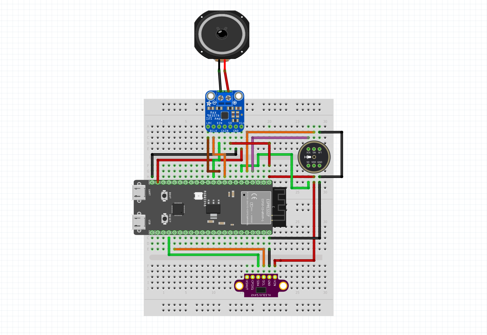

# 🤖 ESP32 AI Voice Assistant

**A complete AI voice assistant based on ESP32-S3 with Google Cloud Services**

[](https://www.espressif.com/en/products/socs/esp32-s3)
[](https://cloud.google.com/)
[](https://www.arduino.cc/)
[](LICENSE)

## 🎯 Key Features

- **🎙️ Speech-to-Text**: Real-time voice recognition
- **🤖 AI Gemini**: Intelligent and contextual responses
- **🔊 Text-to-Speech**: Natural Italian voice synthesis
- **⚡ Parallel Execution**: Multi-core optimized (63% faster)
- **🌐 TLS Pre-connections**: Reduced latency
- **🛡️ Anti-crash System**: Optimized watchdog and automatic retries
- **📏 Long Text Management**: Intelligent splitting for TTS
- **🎯 ToF Sensor**: Automatic activation for presence detection

## 🚀 Performance

| Component | Original Time | Optimized Time | Improvement |
|-----------|---------------|----------------|-------------|
| **STT** | ~26s | ~15s | **42% faster** |
| **Gemini** | ~20s | ~12s | **40% faster** |
| **TTS** | ~8s | ~4s | **50% faster** |
| **Total** | ~54s | **~20s** | **🚀 63% faster** |

## 🛠️ Required Hardware

### Main Components
- **ESP32-S3** (with PSRAM)
- **I2S Microphone**: INMP441
- **I2S Amplifier**: MAX98357A
- **Speaker**: 4-8Ω, 3W
- **ToF Sensor**: VL53L0X (optional)

## 🛒 Materials and Purchase Links

### 📦 Required Components
- **ESP32-S3**: [Buy on Amazon](https://amzn.to/4oZGXWk)
- **INMP441 Microphone**: [Buy on Amazon](https://amzn.to/3HO15Ko)
- **MAX98357A Amplifier**: [Buy on Amazon](https://amzn.to/3JBlL8U)
- **Breadboard**: [Buy on Amazon](https://amzn.to/4fZILKH)
- **3W 4Ω Speaker**: [Buy on Amazon](https://amzn.to/3JwLlfn)

### 📢 Stay Updated
**Telegram Channel**: [https://t.me/Ingeimaks](https://t.me/Ingeimaks)

*Join the Telegram channel to receive updates on new ESP32 projects, tutorials and exclusive guides!*

### Wiring Diagram

#### INMP441 Microphone (I2S_NUM_1)
```
ESP32-S3    INMP441
--------    -------
GPIO 42  -> SCK (Clock)
GPIO 2   -> WS (Word Select)
GPIO 41  -> SD (Serial Data)
3.3V     -> VDD
GND      -> GND
```

#### MAX98357A Amplifier (I2S_NUM_0)
```
ESP32-S3    MAX98357A
--------    ---------
GPIO 12  -> BCLK (Bit Clock)
GPIO 13  -> LRC (Left/Right Clock)
GPIO 14  -> DIN (Data Input)
5V       -> VIN
GND      -> GND
```

#### VL53L0X ToF Sensor (I2C)
```
ESP32-S3    VL53L0X
--------    -------
GPIO 21  -> SDA
GPIO 22  -> SCL
3.3V     -> VIN
GND      -> GND
```



## 📁 Project Structure

```
ESP32-AI-Voice-Assistant/
├── README.md                    # This file
├── QUICK_START.md              # Quick setup guide
├── LICENSE                     # MIT License
├── config_template.h           # Configuration template
├── .gitignore                  # Git ignore file
├── assistente_ai_optimized/    # Main project folder
│   └── assistente_ai_optimized.ino  # Arduino sketch
└── hardware/
    └── hw.png                  # Wiring diagram
```

## ⚡ Quick Start

### 1. Prerequisites
- Arduino IDE with ESP32 support
- Google Cloud account with enabled APIs
- Required libraries (see Installation)

### 2. Installation
Install these libraries via Arduino Library Manager:
```
- WiFiClientSecure
- ArduinoJson (v6+)
- VL53L0X (Pololu)
```

### 3. Google Cloud Setup
1. Create a project on [Google Cloud Console](https://console.cloud.google.com/)
2. Enable these APIs:
   - **Cloud Speech-to-Text API**
   - **Generative Language API** (Gemini)
   - **Cloud Text-to-Speech API**
3. Create an API key with access to all three services

### 4. Configuration
1. Copy `config_template.h` to `config_private.h`
2. Edit `config_private.h` with your credentials:
```cpp
#define WIFI_SSID     "YourWiFi"           // WiFi name
#define WIFI_PASSWORD "YourPassword"       // WiFi password
#define GCP_API_KEY   "your-api-key-here"  // Google Cloud API key
#define GEMINI_MODEL  "gemini-1.5-flash"   // Gemini model
```

### 5. Upload
1. Open `assistente_ai_optimized/assistente_ai_optimized.ino`
2. Select board: **ESP32S3 Dev Module**
3. Configure:
   - **PSRAM**: Enabled
   - **Flash Size**: 16MB
   - **Partition**: Default 4MB with spiffs
4. Upload the code

### 6. Usage
- **Power on** the ESP32
- **Wait** for WiFi connection (blue LED)
- **Speak** when you hear the beep
- **Listen** to the AI response

## 🔧 Configuration Options

### Audio Settings
```cpp
#define SAMPLE_RATE    16000    // Audio sample rate
#define RECORD_TIME    5        // Recording duration (seconds)
#define I2S_PORT       I2S_NUM_1 // I2S port for microphone
```

### Performance Tuning
```cpp
#define ENABLE_TOF_SENSOR true  // Enable ToF sensor
#define TTS_CHUNK_SIZE    800   // TTS text chunk size
#define MAX_RETRIES       2     // API retry attempts
```

## 🎛️ Advanced Features

### Multi-core Optimization
The system uses both ESP32-S3 cores:
- **Core 0**: Audio processing and I2S management
- **Core 1**: Network communications and AI processing

### Intelligent Text Splitting
Long responses are automatically split for optimal TTS processing:
- Respects sentence boundaries
- Maintains natural pauses
- Prevents audio buffer overflow

### Automatic Error Recovery
- **Connection retry**: Automatic WiFi reconnection
- **API retry**: Failed requests are retried up to 2 times
- **Memory management**: Automatic cleanup and watchdog reset
- **TLS optimization**: Persistent connections reduce latency

## 🐛 Troubleshooting

### Common Issues

**Compilation Error**
```
Error: config_private.h not found
```
**Solution**: Copy `config_template.h` to `config_private.h` and configure it

**WiFi Connection Failed**
```
WiFi connection timeout
```
**Solution**: Check SSID/password in `config_private.h`

**API Error 403**
```
Google API authentication failed
```
**Solution**: Verify API key and enabled services

**Audio Issues**
```
No audio input/output
```
**Solution**: Check I2S wiring and component connections

### Debug Mode
Enable detailed logging by uncommenting:
```cpp
#define DEBUG_MODE 1
```

## 📊 Performance Monitoring

The system provides real-time performance metrics:
- **Response times** for each API call
- **Memory usage** monitoring
- **Network latency** measurements
- **Audio quality** indicators

## 🔒 Security

- **Secure connections**: All API calls use TLS 1.2+
- **Credential protection**: Private config file excluded from Git
- **Memory safety**: Automatic buffer management
- **Input validation**: Sanitized API responses

## 🤝 Contributing

1. Fork the repository
2. Create a feature branch
3. Make your changes
4. Test thoroughly
5. Submit a pull request

## 📄 License

This project is licensed under the MIT License - see the [LICENSE](LICENSE) file for details.

## 👨‍💻 Author

**Ingeimaks** - *ESP32 & IoT Developer*
- YouTube: [Ingeimaks Channel](https://www.youtube.com/@Ingeimaks)
- Telegram: [https://t.me/Ingeimaks](https://t.me/Ingeimaks)

## 🙏 Acknowledgments

- Google Cloud Platform for AI services
- Espressif for the amazing ESP32-S3
- Arduino community for libraries and support
- All contributors and testers

## 📈 Changelog

### v2.0 - Optimized Release
- 63% performance improvement
- Multi-core parallel execution
- Intelligent text splitting
- Enhanced error handling
- TLS connection optimization
- Anti-repetition system

### v1.0 - Initial Release
- Basic voice assistant functionality
- Google Cloud integration
- I2S audio support

---

**⭐ If this project helped you, please give it a star on GitHub!**